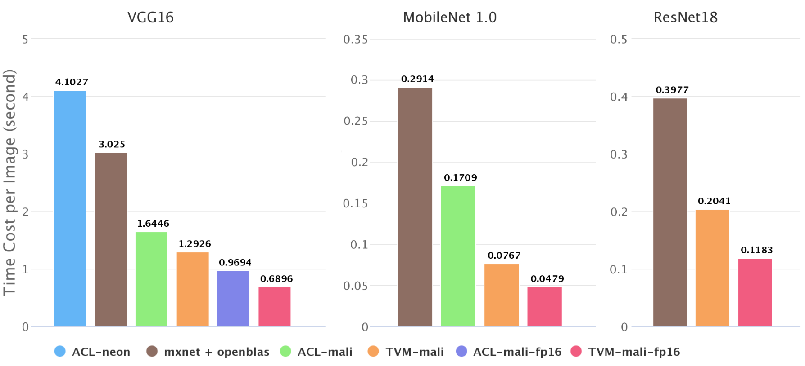

# Benchmarking Deep Neural Networks on ARM CPU/GPU



## Run Test for TVM/NNVM
In TVM, we use [RPC](http://nnvm.tvmlang.org/tutorials/deploy_model_on_rasp.html) to do test,
so you should build TVM runtime and start a RPC server on your device.
```
python -m tvm.exec.rpc_server --host 0.0.0.0 --port=9090
```

Then in your host machine, run the test commond
``` bash
python mali_imagenet_bench.py --target-host TARGET_HOST --host HOST --port PORT --model all
```
Replace the `TARGET_HOST`, `HOST` and `PORT` with the corresponding values in your environment.

For example, on my Firefly-RK3399, the commond is 
``` bash
python mali_imagenet_bench.py --target-host 'llvm -target=aarch64-linux-gnu -mattr=+neon' --host 10.42.0.96 --port 9090 --model all
```

## Run Test for MXNet + Openblas
This test is executed locally on your device. So you need install the mxnet with openblas on your device first.

``` bash
python mxnet_test.py --model all
```

## Run Test for Arm Compute Library
Build ACL by cross-compile on host system.
``` bash
scons Werror=1 neon=1 opencl=1 examples=1 benchmark_tests=1 os=linux arch=arm64-v8a embed_kernels=1 -j$(nproc)
```

copy acl\_test.cc to the root directoy of ACL and build the acl\_test by
``` bash
aarch64-linux-gnu-g++ acl_test.cc build/utils/*.o -O2 -std=c++11\
    -I. -Iinclude -Lbuild -Lbuild/opencl-1.2-stubs/\
     -larm_compute -larm_compute_graph -larm_compute_core -lOpenCL -o acl_test
```

copy the binary file acl\_test to your device and run
```
./acl_test all
cat result-acl.txt
```
results are recored in `result-acl.txt`

## Result
Paste the outputs on my board here.

### TVM/NNVM
```
============================================================
model: vgg16, dtype: float32
warm up..
test..
cost per image: 1.2926s
============================================================
model: vgg16, dtype: float16
warm up..
test..
cost per image: 0.6896s
============================================================
model: resnet18, dtype: float32
warm up..
test..
cost per image: 0.2041s
============================================================
model: resnet18, dtype: float16
warm up..
test..
cost per image: 0.1183s
============================================================
model: mobilenet, dtype: float32
warm up..
test..
cost per image: 0.0767s
============================================================
model: mobilenet, dtype: float16
warm up..
test..
cost per image: 0.0479s
```

### MXNet + Openblas
```
============================================================
model: vgg16, dtype: float32
warm up...
test..
cost per image: 3.0250s
============================================================
model: resnet18, dtype: float32
warm up...
test..
cost per image: 0.3977s
============================================================
model: mobilenet, dtype: float32
warm up...
test..
cost per image: 0.2914s
```

### ACL
```
backend: cl    model: vgg16      conv_method: gemm     dtype: float32   cost: 1.64456
backend: cl    model: vgg16      conv_method: gemm     dtype: float16   cost: 0.969372
backend: cl    model: vgg16      conv_method: direct   dtype: float32   cost: 3.90031
backend: cl    model: vgg16      conv_method: direct   dtype: float16   cost: 1.61179
backend: cl    model: mobilenet  conv_method: gemm     dtype: float32   cost: 0.170934
backend: cl    model: mobilenet  conv_method: direct   dtype: float32   cost: 0.173883
backend: neon  model: vgg16      conv_method: gemm     dtype: float32   cost: 4.10269
```

